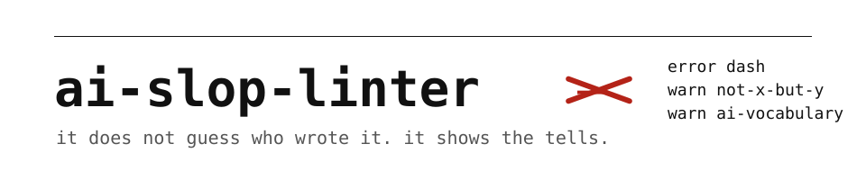

<p align="center"></p>

<p align="center">English | <a href="README.tr.md">Türkçe</a></p>

<p align="center"><em>It does not guess who wrote it. It shows the tells.</em></p>

<p align="center">
  
  
  
  
  
  
</p>

Readers have learned the tells of machine writing: the em dash, `not just X but Y`,
`I hope this helps`, `a testament to`, the bold label on every bullet. Once they see
one, they stop reading. ai-slop-linter is a linter for those tells. Point it at a commit
message, a pull request description, a README or an article and it lists each one with
a line number, a reason, and a fix where a fix cannot change the meaning.

It is a linter, not a detector. It never outputs a probability that a model wrote the
text. Every rule names its source, and a clean pass means one thing: none of the listed
tells are there.

## 30 seconds

```
npx ai-slop-linter README.md          # lint one file (exit 1 if it has errors)
npx ai-slop-linter                    # every .md file under the current directory
npx ai-slop-linter --commit           # the last commit message
npx ai-slop-linter README.md --fix    # apply the safe fixes in place
```

`slop` is the same binary, for people who type it a lot.

## What it looks like

Real output on [`test/fixtures/sloppy.md`](test/fixtures/sloppy.md), a 252-word file
written to trip every rule once (first eleven of fifty findings):

```
test/fixtures/sloppy.md  F (score 199.6, 252 words, 50 findings)
     5:1   info    title-case-heading   Title Case heading; sentence case reads as written by a person
     7:1   warning announcing           "Let's dive into": make the point instead of announcing it
     7:26  error   dash                 em dash
     7:32  warning inflated             "is a testament to": say what happened; let the reader judge the importance
     7:37  warning ai-vocabulary        "testament": a word models reach for; use the plain one
     7:72  warning ai-vocabulary        "In today's fast-paced": a word models reach for; use the plain one
     7:83  info    hyphen-density       7.9 hyphenated compounds per 100 words; drop the hyphen after the noun
     7:115 warning inflated             "stands as a": say what happened; let the reader judge the importance
     7:127 warning inflated             "pivotal moment": say what happened; let the reader judge the importance
     7:127 warning ai-vocabulary        "pivotal": a word models reach for; use the plain one
     7:156 warning ing-tail             ", highlighting": cut the tail or make it its own sentence with a fact in it
```

Each file gets a score, weighted findings per 1,000 words (error 3, warning 1,
info 0.3), and a grade: A under 3, B under 8, C under 15, D under 30, F above. The run
exits 1 when any file has an error-severity finding or a score above `--max-score`
(default 10), so it can sit in CI without a cleanup commit first.

## The rules

Twenty rules. Most come from the Wikipedia guideline
[Signs of AI writing](https://en.wikipedia.org/wiki/Wikipedia:Signs_of_AI_writing),
written by editors who review thousands of machine-written edits; the two marked "house"
are ours. Run `npx ai-slop-linter --rules` for the same list from the binary.

| rule | severity | what it catches | fix |
|---|---|---|---|
| `dash` | error | em dash or en dash used as a dash (ranges like 2019–2021 are left alone) | comma, full stop, or removed after punctuation |
| `chatbot` | error | `I hope this helps`, `Certainly!`, `Let me know if`, `As an AI` | |
| `cutoff-disclaimer` | error | `as of my last update`, `as of [date], I cannot` | |
| `not-x-but-y` | warning | `not just X but Y`, `It's not X. It's Y.`, `not because A, because B` | |
| `triad` | warning | three single words in a row sharing a suffix (`careful, thoughtful, and mindful`) | |
| `reveal` | warning (house) | `The real question is`, `At its core`, `What really matters` | |
| `ing-tail` | warning | a comma then `, highlighting`, `, showcasing`, `, underscoring` | |
| `inflated` | warning | `is a testament to`, `pivotal`, `stands as a`, `marks a turning point` | |
| `ai-vocabulary` | warning | `delve`, `tapestry`, `robust`, `seamless`, `vibrant`, `leverage`, `elevate`, `foster`, `crucial`, abstract `landscape` and friends | |
| `sales` | warning | `world-class`, `best-in-class`, `state-of-the-art`, `cutting-edge`, `nestled in the heart of` | |
| `vague-source` | warning | `experts argue`, `studies show`, `it is widely believed` (silent when the line has a link) | |
| `announcing` | warning (house) | `Let's dive in`, `In this article we will`, `Without further ado` | |
| `closer` | warning | `Exciting times ahead`, `the future looks bright`, `stay tuned` | |
| `bold-label` | warning | `- **Speed:** ...` mini-headings in list items | |
| `emoji` | warning | emoji decorating a heading or list item | |
| `filler` | info | `in order to`, `due to the fact that`, `it is important to note that` | the plain phrase |
| `curly-quotes` | info | `“ ” ‘ ’` | straight quotes |
| `title-case-heading` | info | Every Word Capitalised In A Heading (ALL CAPS is left alone) | |
| `challenges-section` | info | a `Challenges and future outlook` section | |
| `hyphen-density` | info | more than three hyphenated compounds per hundred words | |

Fenced code, inline code, front matter, link targets, URLs, HTML tags and comments are
masked before any rule runs, so a dash in a code sample is never a finding.

To silence a finding you have judged wrong:

```markdown
<!-- slop-ignore-next-line dash -->
<!-- slop-ignore vague-source, triad -->    (from here to the end of the file)
```

A `.slop.json` at the root sets defaults: `{ "include": ["docs/**/*.md"], "ignore": ["emoji"], "maxScore": 5 }`.

## Fixes

`--fix` only does what cannot change meaning: dashes become commas or full stops, curly
quotes become straight, filler phrases become their plain form. It runs to a fixed
point (fixing a fixed file changes nothing) and leaves every other finding for you,
because `not just X but Y` needs a rewritten sentence, not a character swap.

## In a repository

**Pull requests.** The Action lints the pull request title, its description and every
changed Markdown file, annotates the lines on the files tab, and keeps one comment on the
pull request with the findings table, updated in place on every push:

```yaml
name: prose
on: pull_request
permissions:
  contents: read
  pull-requests: write   # read is enough with comment: "false"
jobs:
  slop:
    runs-on: ubuntu-latest
    steps:
      - uses: actions/checkout@v7
      - uses: Bubblegunn/ai-slop-linter@v0.1.0
        # with:
        #   max-score: "5"
        #   baseline: ".slop-baseline.json"
        #   comment: "false"
        #   warn-only: "true"
```

| input | default | what it does |
|---|---|---|
| `files` | changed `.md` files | Files or globs to lint instead of the changed Markdown |
| `pr-body` | `true` | Lint the title and description as one more text |
| `comment` | `true` | Post and update the review comment; needs `pull-requests: write` |
| `baseline` | none | A file from `--baseline-write`; only new findings fail |
| `max-score` | `10` | Fail above this weighted score per 1,000 words |
| `warn-only` | `false` | Annotate and comment, never fail |

The Action outputs `findings`, the total count, for a later step.

**Commit messages.** A `commit-msg` hook refuses a message with an error-severity tell:

```
curl -fsSL https://raw.githubusercontent.com/Bubblegunn/ai-slop-linter/main/scripts/install-hook.sh | sh
```

Skip it once with `git commit --no-verify`. The hook reads the message file git hands
it; `npx ai-slop-linter --commit-msg "$1"` is all it does.

**Pull request bodies from the shell.** `npx ai-slop-linter --pr 42` reads the body
through `gh` and lints it like a file.

**Adopting it in a repository with history.** A baseline records the findings that are
already there, so the check fails only on new ones and nobody has to land a cleanup
commit first:

```
npx ai-slop-linter --baseline-write      # writes .slop-baseline.json
npx ai-slop-linter --baseline            # fails only on findings the baseline does not list
```

Entries are keyed by file, rule and the sentence, not by line number, so editing above
a known tell does not make it new. Commit the file; `"baseline": "path"` in `.slop.json`
names a different one. When a file is cleaned up, run `--baseline-write` again to shrink it.

**CI output.** `--format github` prints workflow annotations and an error line for every
text that fails; `--format markdown` prints the table the Action posts, for an issue or a
review; `--format json` prints findings with `fixable` flags for other tools.

## For agents

Most of the tells above are written by coding agents, in the commit messages and pull
request descriptions they produce all day. The skill makes an agent lint its own prose
before it hands it over, and carries the rules in plain language for an agent with no
shell:

```
npx skills add Bubblegunn/ai-slop-linter        # 56 agent directories
```

Or as a Claude Code plugin:

```
/plugin marketplace add Bubblegunn/ai-slop-linter
/plugin install ai-slop-linter@ai-slop-linter
```

## From code

```ts
import { lintText, fixText } from "ai-slop-linter";

const r = lintText("post.md", text);
r.grade;              // "A" .. "F"
r.findings[0];        // { rule, severity, line, column, excerpt, message, fix? }

const f = fixText("post.md", text);
f.text;               // fixed text
f.applied;            // number of fixes
```

## Run on our own writing

The tool on the four READMEs its author maintains and on the eleven essays on the author's site,
run on 5 September 2026 (`npx ai-slop-linter <file> --warn`):

| text | words | grade | findings |
|---|---|---|---|
| [workproof](https://github.com/Bubblegunn/workproof) README | 1,105 | A (0) | none |
| [proactive-gate](https://github.com/Bubblegunn/proactive-gate) README | 1,213 | A (0) | none |
| [surviving-lines](https://github.com/Bubblegunn/surviving-lines) README | 712 | A (0) | none; the first run found 2 bold labels in a list, fixed the same day |
| [product-engineer](https://github.com/Bubblegunn/product-engineer) README | 865 | A (0) | none; the first run scored C (8.7) for 7 bold labels in the rule list |
| 8 of 11 portfolio essays | 856 to 1,849 each | A (0) | none |
| the other 3 essays | 871 to 1,601 | A (0.4 to 1.1) | `state-of-the-art` once, `elevated` once, `in order to` twice |

The C was real: the first product-engineer README listed its seven rules as
`**Name:** text` bullets, exactly the pattern the rule flags. Later the same day that
README was rewritten to show the tool before explaining it, and the rule list became
plain sentences on the way; it was not edited to please the linter, and the row keeps
the earlier score so the table stays a record of runs, not a scoreboard. The linter runs
on this repository's own Markdown in CI with `maxScore` 3.

## What it cannot show

- Authorship. A person who writes `delve` gets the same finding as a model. Passing
  says the tells are absent; it says nothing about who typed.
- Meaning. It cannot tell a hollow paragraph from a good one when the hollow one
  avoids every listed phrase. Text that passes can still be empty.
- Style outside the list. Twenty rules cover the patterns editors flag most; a
  writer with a different tell passes. Add a rule when you find one.
- Other languages. The vocabulary rules are English. The structural ones (dashes,
  quotes, bold labels, emoji, headings) work anywhere. Rule sets for a second language
  are on the [roadmap](ROADMAP.md).

## Contributing

Adding a rule is one function, one fixture sentence and one table row; see
[CONTRIBUTING.md](CONTRIBUTING.md), which also describes the one-command release. Zero runtime
dependencies, Node 20 or newer, tests with `node:test`.

## Licence

MIT. Rule sources are credited in the table above and in `--rules`.
